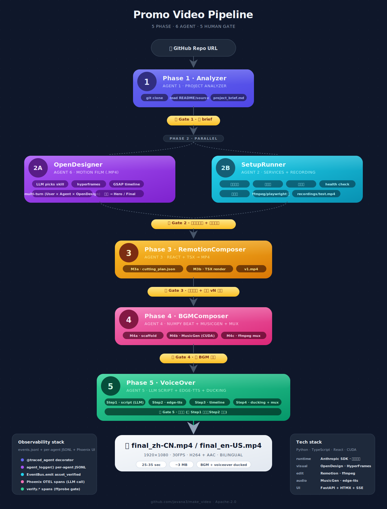

# 🎬 Promo Video Pipeline

> 把任意 GitHub 项目 → 30 秒 AI 宣传视频。**Agent 自己读源码 + 自己操作项目演示 + 自己决定怎么剪**。
>
> 5 个 Phase，6 个 Agent，全链路 trace 进 self-hosted Langfuse。
> 视觉资产用 [Open Design](https://github.com/nexu-io/open-design) 的 `hyperframes` + `static_hero` skill；
> 演示录制用 playwright（web 项目）/ pyte+PIL（CLI 项目）；
> 剪辑用 [Remotion](https://www.remotion.dev/)，BGM 用 MusicGen，配音用 edge-tts。

<p align="center">
  <a href="README.md"><b>简体中文</b></a> ·
  <a href="README.en.md">English</a> ·
  <a href="README.ja.md">日本語</a> ·
  <a href="README.ko.md">한국어</a>
</p>

<p align="center">
  
</p>

---

## ✨ 核心特点

- **Demo Driver = 自主演示员 Agent**：读项目源码 → 决定演什么 → 用 playwright/pty 真操作 → 自己判定演完再停。**没有时长 cap**，项目要 1000 万年才演完整就录 1000 万年。
- **三轨混剪**：剪辑 Agent 拿 (a) Demo Driver 的真实操作录像 + (b) OpenDesigner 的 hyperframe 动画 + (c) static_hero HTML 设计页 三种背景源，自己决定怎么混——没有预设比例规则。
- **User-in-loop 全程贯穿**：5 个人工拍板节点，加 Demo Driver 跑的时候 user 可以随时打字"跳过登录 / focus 这个功能 / 行了停"，Agent 下一轮就听到。
- **全链路 Observability**：events.jsonl + 每 agent 独立 JSONL + self-hosted Langfuse UI，每个 LLM 调用 + 每个内部 step (`MusicGen.load_model` / `http.GET /api/...` / `pty.send` / `browser.click`) 都嵌套挂在 Agent span 下。
- **6 个 LLM Agent**：每阶段一个 Agent，基于 Anthropic SDK + tool-use loop，agent 决策 + user 反馈，**不写状态机**。

---

## 🏗 架构

```
[GitHub URL]
     │
     ▼
┌─ Phase 1 · Agent 1 ProjectAnalyzer ─────────────────────────────┐
│   git clone → list_dir / read_file 读源码 → project_brief.md     │
│   ⏸ 人工介入 #1：审 brief（定位 / 受众 / tone — 不是演示清单）        │
└──────────────────────────────────────────────────────────────────┘
     │
     ▼
┌─ Phase 2 · 并行段 ────────────────────────────────────────────────┐
│  路 A · Agent 6 OpenDesigner（视觉资产）                            │
│      brief → 选 skill (hyperframes / static_hero)                  │
│      → 多轮 (User × Agent × OpenCode CLI × Open Design daemon)     │
│      ├─ hyperframes → motion_film .mp4 (放 hyperframes/)           │
│      └─ static_hero → 设计 HTML 页 (放 html_asset/)                 │
│                                                                   │
│  路 B1 · Agent 2 SetupRunner（启项目）                              │
│      读源码 + README → setup_plan.json                             │
│      → install / seed / start services（user 审 plan）              │
│                                                                   │
│  路 B2 · Demo Driver Agent（演示项目）                              │
│      读源码自己判断该演什么                                          │
│      ├─ web 项目：playwright BrowserSession（goto/click/fill/wait） │
│      └─ CLI 项目：PtySession（pty_send/wait_for/screen）            │
│      → 全程录制（无时长 cap）+ 双语 caption 时间戳                    │
│      → recordings/demo.mp4 + demo_captions.jsonl                   │
│   ⏸ 人工介入 #2：随时插话 + 演完审录像                                │
└──────────────────────────────────────────────────────────────────┘
     │
     ▼
┌─ Phase 3 · Agent 3 RemotionComposer ────────────────────────────┐
│   M3a · cutting_plan.json — Agent 自主混剪：                       │
│         • recording (Demo Driver 的真录像)                         │
│         • hyperframe (OpenDesigner motion_film .mp4)               │
│         • html (OpenDesigner static_hero HTML 页 + scroll/zoom)     │
│         + caption 轨从 demo_captions.jsonl 拉                      │
│   M3b · cutting_plan → TSX → npm install → render → v1.mp4         │
│   ⏸ 人工介入 #3：剪辑思路 + vN 反馈                                  │
└──────────────────────────────────────────────────────────────────┘
     │
     ▼
┌─ Phase 4 · Agent 4 BGMComposer ──────────────────────────────────┐
│   M4a · numpy 节拍脚手架（kicks 对齐 scene 切割）                    │
│   M4b · MusicGen-small/melody（CUDA fp16，~40s 推理）                │
│   M4c · ffmpeg mux → v1_bgm_final.mp4                              │
│   ⏸ 人工介入 #4：听 BGM 反馈                                         │
└──────────────────────────────────────────────────────────────────┘
     │
     ▼
┌─ Phase 5 · Agent 5 VoiceOver（4 步串行）────────────────────────┐
│   Step1 · LLM 写 voiceover_script.json (中英双语)                  │
│   Step2 · edge-tts 逐句合成 mp3                                    │
│   Step3 · voice_timeline 拼成 voice_full.wav                       │
│   Step4 · BGM ducking + amix mux → final_zh-CN/en-US.mp4           │
│   ⏸ 人工介入 #5：审脚本                                              │
└──────────────────────────────────────────────────────────────────┘
     │
     ▼
[final_zh-CN.mp4 / final_en-US.mp4]
```

---

## 🤖 Demo Driver — 项目核心

跟传统"启服务 → 录 30 秒"完全不同。**Demo Driver 是个自主 Agent**，工具集分四类：

### 1. 源码工具（决定"演什么"）
`list_dir` / `read_file` / `find_files` / `grep` — Driver 用这些读项目代码：route handler、main loop、CLI command、feature module。**演什么由代码决定，不由 brief 的"独特卖点"列表决定**——marketing copy 谈定位，源码谈现实。

### 2. 项目操作工具（决定"怎么演"）

**Web 模式**（setup_plan 里有 `health_url` 时）：
```
browser_goto / browser_click / browser_fill / browser_press / browser_scroll
browser_hover / browser_wait_for
browser_screenshot     ← 返回 PNG 给 Agent 看（vision）
browser_visible_text   ← document.body.innerText
browser_a11y_snapshot  ← 走 CDP Accessibility.getFullAXTree
browser_interactables  ← 列出可点击/可输入元素 + 稳定 selector
```
底层是 `tools/browser_session.py` 的 `BrowserSession`：playwright chromium + `record_video_dir` 全程原生录制，stop 时 webm → mp4。

**CLI 模式**（无 services 或 service.command 是 CLI 程序）：
```
pty_send (写 stdin)        pty_wait_for (regex on screen)
pty_screen (整个 pyte 网格) pty_read_recent (尾部 n 行)
pty_is_alive
```
底层是 `tools/pty_session.py` 的 `PtySession`：subprocess + pyte 终端模拟器 + 后台采样线程，每 1/fps 渲一张 PNG，stop 时 ffmpeg 拼成 mp4。**没有 30 秒死时长**——Driver 自己判定演完才 stop。

### 3. 演示控制工具
- `mark_caption(zh, en, importance)` — 给当前录制时间戳打双语字幕，写入 `demo_captions.jsonl`，下游 Phase 3 拿这个当字幕轨用，不再让 LLM 编。
- `ask_user(question)` — 阻塞等用户回复（user 在 web UI 输入 → 写 `live_feedback.jsonl` → Driver 读到）。
- `finish_demo(summary, completeness)` — Driver 自己判定演完，结束 loop + stop session + 出 mp4。
- `log_thought(text)` — 写日志不影响视频。

### 4. User-in-loop（不是工具，是回路）
User 在 Web UI 的 textarea 里随时打字，例：
```
跳过登录直接演主功能
你这一步太快了，下次先 wait
行了停吧
```
消息追加到 `live_feedback.jsonl`，Driver **每轮 LLM 调用前**读尾部新增条目，splice 进 conversation：
```
[USER LIVE FEEDBACK]: 跳过登录直接演主功能
```
LLM 下一轮 think 就会看到并调整。

---

## 🎨 三轨混剪（Phase 3）

`cutting_plan.json` 的 `background.type` 五种：`color` · `gradient` · `recording` · `hyperframe` · `html`。

| 类型 | 来源 | 用途 |
|---|---|---|
| `recording` | Demo Driver 的录像 `recordings/test.mp4` | 真实感、authenticity |
| `hyperframe` | OpenDesigner motion_film 模式输出 `hyperframes/*.mp4` | polished 动画、design-feel |
| `html` | OpenDesigner static_hero 模式输出 `html_asset/index.html` | hero/intro/outro 设计页（live `<iframe>`，可 scroll + zoom） |
| `color` / `gradient` | 纯色/渐变 | 文字密集场景的可读性背景 |

**没有预设比例**。RemotionComposer Agent 收到 `available_assets` 列表后自己决定混。`SYSTEM_PROMPT` 里只给 hard rules：
- **R3**：recording 必须跳头尾各 5 秒（unstable frames）；hyperframe/html 没这规则（OpenDesign 输出干净）
- **R4** 可读性：title-style 大字短文必须配 recording/hyperframe + darken 0.65–0.85，或 html；body-style 小字必须配 color/gradient/html，或 recording/hyperframe + darken ≥ 0.7
- **R5**：相邻场景默认 crossfade 15 帧
- **R6**：每个 `source_path` 必须真实存在于 `available_assets` 里

`tools/remotion_codegen.py` 把 plan 翻译成 TSX：
- `recording` / `hyperframe` → `<Video>` / `<OffthreadVideo src={staticFile(...)} startFrom={...}>`
- `html` → 自定义 `<HtmlBg>` 组件：真 `<iframe>` + `onLoad` 触发 `contentWindow.scrollTo(0, scrollMax * pct)` + CSS `transform:scale(zoom)`

---

## 🚀 Quick Start

### 1. 环境准备
```bash
# Python venv + 依赖
python -m venv .venv
.venv/Scripts/pip install -e .                  # Windows
# 或
.venv/bin/pip install -e .                       # *nix

# Playwright Chromium（Demo Driver web 模式必备）
.venv/Scripts/python -m playwright install chromium

# 必备外部
- ffmpeg (PATH)
- Node.js 24 + pnpm 10（Phase 3 Remotion + Phase 2A OpenDesign）
- Docker Desktop（Langfuse 自托管）
- CUDA GPU（可选，Phase 4b MusicGen 加速）
```

### 2. 起 Langfuse 自托管栈
```bash
# 在某个空目录起一份 langfuse-stack：
mkdir langfuse-stack && cd langfuse-stack
curl -O https://raw.githubusercontent.com/langfuse/langfuse/main/docker-compose.yml

# 在 .env 写下 init credentials（任意填）
cat > .env << 'EOF'
SALT=langfuse-local-salt-XXXX
ENCRYPTION_KEY=<openssl rand -hex 32>
NEXTAUTH_SECRET=<openssl rand -hex 32>
LANGFUSE_INIT_ORG_ID=local-org
LANGFUSE_INIT_ORG_NAME=Local
LANGFUSE_INIT_PROJECT_ID=video-pipeline
LANGFUSE_INIT_PROJECT_NAME=video-pipeline
LANGFUSE_INIT_PROJECT_PUBLIC_KEY=pk-lf-local-XXXX
LANGFUSE_INIT_PROJECT_SECRET_KEY=sk-lf-local-XXXX
LANGFUSE_INIT_USER_EMAIL=local@example.com
LANGFUSE_INIT_USER_NAME=Local
LANGFUSE_INIT_USER_PASSWORD=langfuse-local-pw
EOF

# 起 6 个服务：postgres + clickhouse + redis + minio + langfuse-web + langfuse-worker
docker compose --env-file .env up -d
# 等 30s，访问 http://localhost:3000  邮箱 local@example.com / 密码 langfuse-local-pw
```

> 在中国大陆网络下，docker pull `cgr.dev/chainguard/minio` 可能失败 →
> 把 docker-compose.yml 里那行替换成 `docker.io/minio/minio` 即可。
> Redis 端口若与本机已有 redis 冲突，改成 `127.0.0.1:6380:6379`。

### 3. 项目 .env
```ini
# LLM provider（火山方舟 Coding Plan 是默认；其他兼容 Anthropic API 的也行）
ANTHROPIC_BASE_URL=https://ark.cn-beijing.volces.com/api/coding
ANTHROPIC_API_KEY=<your key>
ARK_BASE_URL_OPENAI=https://ark.cn-beijing.volces.com/api/coding/v3
ARK_KEY_1=<your key>
LLM_REASONING=claude-sonnet-4-20250514
LLM_FAST=deepseek-v3.2

# Langfuse 指向（默认就是 docker-compose 起的 :3000）
LANGFUSE_HOST=http://localhost:3000
LANGFUSE_PUBLIC_KEY=pk-lf-local-XXXX     # 跟 langfuse-stack/.env 一致
LANGFUSE_SECRET_KEY=sk-lf-local-XXXX
```

### 4. OpenDesign daemon
```bash
git clone https://github.com/nexu-io/open-design.git
cd open-design
pnpm install
pnpm --filter @open-design/daemon build

# 启 daemon（NODE_TLS_REJECT_UNAUTHORIZED=0 绕开公司 VPN 证书校验）
NODE_TLS_REJECT_UNAUTHORIZED=0 pnpm tools-dev run web
# → Web: http://127.0.0.1:<port>/  Daemon: http://127.0.0.1:<port>/
```

OpenDesign 后端调 OpenCode CLI，OpenCode 接 LLM provider；配 `~/.config/opencode/opencode.json`：
```json
{
  "$schema": "https://opencode.ai/config.json",
  "provider": {
    "volcark": {
      "npm": "@ai-sdk/openai-compatible",
      "options": {
        "baseURL": "https://ark.cn-beijing.volces.com/api/coding/v3",
        "apiKey": "<YOUR_KEY>"
      },
      "models": {
        "doubao-seed-code": { "name": "Doubao Seed Code" }
      }
    }
  },
  "model": "volcark/doubao-seed-code"
}
```

### 5. 跑流水线
```bash
# CLI 启 Phase 1
.venv/Scripts/python -m src.cli analyze https://github.com/<user>/<repo>

# 启 Web UI
.venv/Scripts/python -m src.cli serve --port 7860
# → http://127.0.0.1:7860/
```

Web UI 上各 Phase 的人工拍板按钮 + Demo Driver 实时面板（progress / captions / 双向聊天）+ Phase 3-5 跑/采纳路由都齐。

---

## 📊 Observability

每条 run 在 `workspace/<project>/runs/<run_id>/` 下持久化：

```
project_brief.md                    Phase 1 输出
setup_plan.json                     Phase 2B SetupRunner 输出
recordings/
  demo.mp4                          Demo Driver 录像
  test.mp4                          采纳后的 phase 2 录像（= demo.mp4）
demo_captions.jsonl                 Demo Driver 双语字幕轨
demo_summary.md                     Demo Driver 总结
demo_driver_progress.json           运行时进度（web UI 轮询）
live_feedback.jsonl                 user → driver 实时聊天
hyperframes/*.mp4                   OpenDesigner motion_film 输出
html_asset/                         OpenDesigner static_hero 输出
cutting_plan.json                   Phase 3a Composer 输出
remotion/                           Phase 3b 生成的 Remotion 项目
outputs/v1.mp4                      Phase 3 渲染产物
outputs/v1_bgm_final.mp4            Phase 4 加 BGM 后
outputs/final_zh-CN.mp4             Phase 5 加配音后
events.jsonl                        全 lifecycle 事件
logs/
  pipeline.jsonl                    全 agent 行级日志
  agent1_analyzer.jsonl             Phase 1
  agent2_setup.jsonl                Phase 2B-plan / exec
  demo_driver.jsonl                 Phase 2C
  agent3_remotion.jsonl             Phase 3
  agent4_bgm.jsonl                  Phase 4
  agent5_voice.jsonl                Phase 5
  agent6_opendesigner.jsonl         Phase 2A
opendesign/state.json               Agent 6 session 状态
```

**Langfuse UI**：http://localhost:3000/ — 全部 LLM call + verify span + traced_step 嵌套，持久化在 docker volumes（postgres + clickhouse + minio + redis），重启不丢。

每个 Agent 入口挂 `@traced_agent("Agent N · 子步骤", phase=N)` 装饰器，自动 emit `agent_start` / `agent_done` 事件 + 创建 OTEL parent span；内部关键步骤用 `traced_step("MusicGen.load_model", ...)` context manager 嵌套，可在 Langfuse 一棵树看到 Agent 4 BGM → MusicGen.load_model → MusicGen.tokenize_inputs → MusicGen.generate → MusicGen.write_wav。Anthropic SDK 调用通过 `openinference-instrumentation-anthropic` 自动 instrument 进来，prompt / response / tool_use / tool_result / token usage 全捕获。

---

## 🛠 Tech Stack

| 层 | 技术 |
|---|---|
| Agent runtime | Python 3.13 + Anthropic SDK + 火山方舟 Coding Plan |
| Web UI | FastAPI + Jinja2 + HTMX + SSE + Tailwind CSS |
| Observability | Langfuse (self-hosted via docker compose) + loguru + OTEL HTTP exporter + openinference-instrumentation-anthropic |
| Demo Driver / web | playwright (chromium headless) + record_video_dir + CDP a11y |
| Demo Driver / CLI | subprocess + pyte (terminal emulator) + PIL + ffmpeg image-seq |
| 视觉资产 | OpenDesign daemon + OpenCode CLI + HyperFrames (HTML→MP4 + GSAP) |
| 视频剪辑 | Remotion (React + TSX → mp4)，含 OffthreadVideo + 自定义 HtmlBg iframe 组件 |
| BGM | numpy 节拍脚手架 + facebook/musicgen-{small,melody} (PyTorch CUDA fp16) |
| 配音 | edge-tts (Microsoft Azure Neural TTS) + ffmpeg sidechaincompress ducking |

---

## 📁 项目结构

```
src/
├── agents/
│   ├── project_analyzer.py    Agent 1
│   ├── setup_runner.py        Agent 2 SetupRunner（plan-only，host 执行）
│   ├── demo_driver.py         Demo Driver Agent（Phase 2C 自主演示）★
│   ├── remotion_composer.py   Agent 3 cutting_plan + 三轨混剪
│   ├── voice_over.py          Agent 5
│   └── opendesigner.py        Agent 6
├── tools/
│   ├── pty_session.py         PtySession (CLI 演示 + 录制) ★
│   ├── browser_session.py     BrowserSession (web 演示 + 录制) ★
│   ├── bgm_scaffold.py        Agent 4 M4a numpy 节拍
│   ├── bgm_musicgen.py        Agent 4 M4b MusicGen
│   ├── bgm_mux.py             Agent 4 M4c ffmpeg
│   ├── tts_edge.py            Agent 5 Step2
│   ├── voice_timeline.py      Agent 5 Step3
│   ├── bgm_duck_mux.py        Agent 5 Step4 ducking + amix
│   ├── opendesign_client.py   Agent 6 daemon HTTP client
│   ├── opendesign_lifecycle.py daemon 启停
│   ├── plan_executor.py       Agent 2 plan 执行
│   ├── service_manager.py     长生命周期服务进程管理
│   ├── recorder.py            ffmpeg gdigrab 备选录窗口
│   ├── remotion_codegen.py    Agent 3 cutting_plan → TSX (含 HtmlBg)
│   └── remotion_render.py     npx remotion render
├── observability/
│   ├── tracer.py              Langfuse OTLP HTTP exporter setup
│   ├── logger.py              loguru + per-agent JSONL
│   ├── audit.py               @traced_agent + traced_step + run_context
│   └── events.py              EventBus (events.jsonl)
├── verify/                    ffprobe 验产物
├── web/
│   ├── main.py                FastAPI 路由 + 模板
│   └── templates/             Jinja2 + HTMX partials
├── pipeline.py                Pipeline class + 状态机
└── cli.py                     viedo CLI

★ = 与 Demo Driver 直接相关的关键新组件
```

---

## 📚 关键文档

- [WORKFLOW.md](WORKFLOW.md) — 5 Phase 状态机、Gate 定义、观测三件套规范
- `src/agents/demo_driver.py` 顶部 docstring — Driver 设计哲学（agent loop + user-in-loop，反 state-machine）
- Langfuse self-host 官方文档：https://langfuse.com/self-hosting

---

## 🤝 致谢

- [nexu-io/open-design](https://github.com/nexu-io/open-design) · Open Design daemon + skills + HyperFrames
- [remotion](https://github.com/remotion-dev/remotion) · React-based 视频合成
- [microsoft/playwright](https://github.com/microsoft/playwright-python) · 浏览器自动化 + 视频录制
- [selectel/pyte](https://github.com/selectel/pyte) · Pythonic 终端模拟器
- [facebook/musicgen](https://huggingface.co/facebook/musicgen-melody) · 文本驱动音乐生成
- [edge-tts](https://github.com/rany2/edge-tts) · Microsoft Azure Neural TTS 包装
- [Langfuse](https://github.com/langfuse/langfuse) · LLM observability (self-hosted)

---

## 📝 License

Apache-2.0
